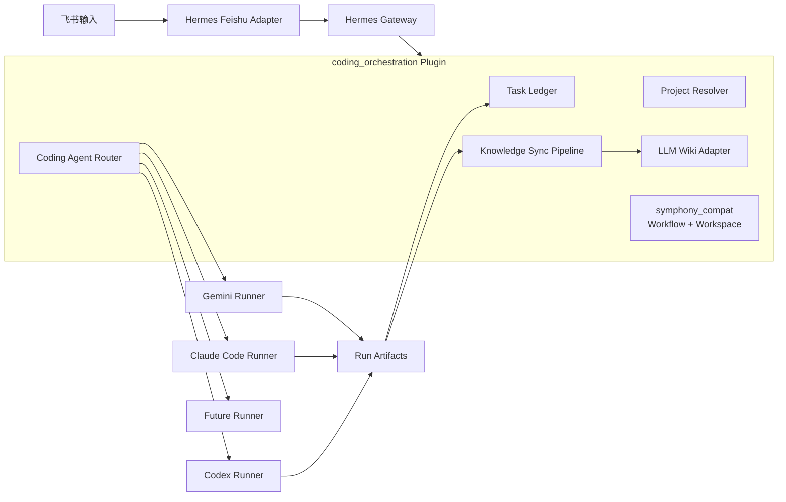

# Hermes Coding Orchestration Plugin：可扩展 Coding Agent 的 MVP 计划

## 0. 开发初衷与要解决的痛点

这个插件的初衷，是把当前“人手动把飞书需求交给编码工具”的流程，收敛成由 Hermes 统一主控、可审计、可回放、可沉淀知识的编码任务编排流程。Hermes 负责接收飞书输入、识别项目、查询 LLM Wiki、生成受控 prompt、调用编码工具、记录运行事实、回写飞书；Codex、Claude Code、Gemini 等工具只作为可替换的编码执行器。

当前主要痛点：

- 需求入口分散：飞书 Wiki、飞书文档、飞书 Project bug、群聊口头需求都需要人工理解和转交。
- 项目切换靠人工：需要手动进入对应项目目录、开启 Codex session、补充上下文，容易漏项目背景和执行规范。
- 上下文不可复用：历史需求、模块归属、QA 经验、测试结论没有稳定沉淀，下次仍要重新解释。
- 运行过程不可审计：手动 session 很难统一记录 prompt、运行参数、stdout/stderr、diff、测试结果和最终总结。
- 发布前链路断裂：自测、修 bug、合并到 test、发布测试环境之间缺少统一任务事实源。
- 工具绑定风险：第一版选择 Codex，但后续可能要接 Claude Code、Gemini；如果流程写死 Codex，后续扩展成本会很高。
- 人工判断点不清晰：哪些情况要问人、哪些情况只回写状态、哪些情况必须阻断，目前靠人工经验临场处理。

这个插件要解决的问题不是“让 AI 自动发布代码”，而是先建立一个最小可行的编码任务控制面：飞书输入可结构化、项目路由有证据、编码工具调用受控、每次运行有 artifact、知识自动写入 LLM Wiki、关键决策保留人工确认。

## 1. 一句话结论

可行：插件不要写死 Codex，而应抽象成 `Coding Agent Runner`，首个实现是 Codex，后续可平滑接 Claude Code、Gemini CLI 或其他编码工具。

## 2. 总体架构



## 3. 命名调整

建议插件不要叫 `codex_orchestration`，而叫：

```text
coding_orchestration
```

原因：

- Hermes 主控的是“编码任务”，不是 Codex 本身。
- Codex 是第一版 runner。
- 后续 Claude Code、Gemini 只是新增 runner，不改 Task Ledger、飞书、LLM Wiki、项目路由、workspace 管理。

本地目录：

```text
~/.hermes/plugins/coding_orchestration/
  plugin.yaml
  __init__.py
  ledger.py
  models.py
  project_resolver.py
  llm_wiki_adapter.py
  prompt_builder.py
  run_summary_writer.py
  feishu_messages.py
  symphony_compat/
    __init__.py
    workflow_loader.py
    workspace_manager.py
    tracker_model.py
  runners/
    __init__.py
    base.py
    codex_cli.py
    codex_app_server.py
    claude_code.py
    gemini.py
```

运行态目录使用中性命名：

```text
~/.hermes/coding-orchestration/
  ledger.db
  runs/
  workspaces/
  llm-wiki/
  project-registry.json
```

## 4. 部署到 Hermes 的原理

- Hermes Gateway 继续作为入口和控制面，飞书消息仍由现有 `gateway/platforms/feishu.py` 接收。
- 新增用户插件 `coding_orchestration`，通过 Hermes 插件系统加载，不直接改 `gateway/run.py`。
- 插件注册 `pre_gateway_dispatch`，在普通 Hermes Agent 接手前识别显式 `/coding` slash 命令。
- 命中 `/coding <action>` 时，插件创建 Task Ledger、查询 LLM Wiki、识别项目、启动 agent run，并返回 `{"action": "skip"}`，避免同一条命令进入普通聊天 session。
- 普通自然语言不进入 plugin；active task binding 只为 `/coding continue`、`/coding bugfix`、`/coding implement` 等显式命令提供默认 task 上下文。多个任务并存时通过 `/coding list` 和 `/coding use <task_id>` 显式切换。
- 未命中 `/coding` 前缀时放行，保持 Hermes 原有聊天能力不变。
- Codex、Claude Code、Gemini 都只是 Runner 实现，不直接调用飞书、不写 Hermes `state.db`、不决定项目。

## 5. Symphony 协议与架构思想的集成

插件不运行原版 Symphony 服务，也不引入 Elixir runtime，只吸收其协议边界：

- `Issue Tracker` -> 飞书需求、Wiki、Doc、Project bug。
- `Issue` -> Task Ledger task。
- `WORKFLOW.md` -> 项目级执行规范。
- `Workspace` -> 每个 run 的隔离 workspace。
- `Agent Run` -> `agent_runs[]`。
- `Orchestrator State` -> Task Ledger。
- `Coding Agent` -> `CodingAgentRunner`。

`symphony_compat` 只定义：

- `Workflow Loader`
- `Workspace Manager`
- `Tracker Model`
- `Agent Run Lifecycle`

Hermes 仍是唯一主控，Task Ledger 仍是运行期事实源。

## 6. 别人如何集成这个插件

插件面向三类接入方：Hermes 维护者、项目维护者、LLM Wiki 提供方。

- Hermes 维护者安装插件到 `~/.hermes/plugins/coding_orchestration/`，并在 `~/.hermes/config.yaml` 的 `plugins.enabled` 中启用。
- 项目维护者优先在 LLM Wiki 写入 `project_profile`，记录项目路径、别名、模块关键词、测试命令和允许修改范围；`WORKFLOW.md` 用于项目内执行规范，`project-registry.json` 只做首次 bootstrap 和兜底。
- LLM Wiki 提供方只需要实现 `search/read/upsert` adapter；MVP 可先用本地 Markdown/SQLite，后续换 HTTP 服务不影响 Hermes 主流程。
- 飞书使用者不需要知道底层 runner 细节，只通过 `/coding task`、`/coding continue`、`/coding bugfix`、`/coding implement` 等显式命令触发；普通自然语言不会进入 plugin。

最小配置：

```yaml
plugins:
  enabled:
    - coding_orchestration

coding_orchestration:
  enabled: true
  default_runner: codex_cli
  run_root: "~/.hermes/coding-orchestration/runs"
  workspace_root: "~/.hermes/coding-orchestration/workspaces"
  ledger_db: "~/.hermes/coding-orchestration/ledger.db"
  project_registry: "~/.hermes/coding-orchestration/project-registry.json"
  default_timeout_seconds: 3600
  heartbeat_interval_seconds: 30
  runners:
    codex_cli:
      enabled: true
      command: "codex"
      args: ["exec"]
      output_format: "json_events"
    codex_app_server:
      enabled: false
      command: "codex"
    claude_code:
      enabled: false
      command: "claude"
    gemini:
      enabled: false
      command: "gemini"
  llm_wiki:
    adapter: "local"
    root: "~/.hermes/coding-orchestration/llm-wiki"
```

## 7. 项目接入契约

每个项目优先通过 `WORKFLOW.md` 接入，插件读取后生成 `WorkflowSpec`。

项目内建议文件：

```text
project/
  WORKFLOW.md
  AGENTS.md
  .codex/config.toml
```

`WORKFLOW.md` 最少说明：

```md
# WORKFLOW

## Allowed Paths
- src/
- tests/

## Forbidden Paths
- .env
- deploy/
- scripts/release*

## Test Commands
- rtk pnpm test
- rtk pnpm build

## Merge Policy
manual_only

## Publish Policy
manual_only

## Recommended Runner
codex_cli
```

推荐在 LLM Wiki 写入 `project_profile`，让 Hermes 以知识库方式识别任意项目：

```json
{
  "kind": "project_profile",
  "project": "order-system",
  "name": "order-system",
  "aliases": ["订单系统", "OMS"],
  "local_paths": ["/Users/xiaojing/Desktop/projects/order-system"],
  "keywords": ["订单", "发货", "库存"],
  "allowed_paths": ["src", "tests"],
  "forbidden_paths": [".env", "deploy"],
  "test_commands": ["rtk pnpm test"],
  "default_runner": "codex_cli",
  "status": "verified"
}
```

如果项目暂时不方便直接写 Wiki，可在 `project-registry.json` 登记作为 bootstrap/fallback：

```json
{
  "projects": [
    {
      "name": "order-system",
      "aliases": ["订单系统", "OMS"],
      "path": "/Users/xiaojing/Desktop/projects/order-system",
      "keywords": ["订单", "发货", "库存"],
      "allowed_paths": ["src", "tests"],
      "forbidden_paths": [".env", "deploy"],
      "default_test_commands": ["rtk pnpm test"],
      "default_runner": "codex_cli"
    }
  ]
}
```

### Project Resolver 匹配规则

Project Resolver 必须输出结构化结果，不能只返回路径：

```ts
{
  project_name: string | null,
  project_path: string | null,
  confidence: number,
  match_evidence: Array<{ source: "explicit" | "alias" | "name" | "keyword" | "llm_wiki" | "llm", value: string, score: number }>,
  candidates: Array<{ project_name: string, project_path: string, confidence: number }>,
  needs_human: boolean
}
```

匹配优先级：

1. `/coding task --project <name>` 显式指定。
2. `aliases` 精确匹配。
3. `name` 精确匹配。
4. `keywords` 命中并按命中数、标题权重、正文权重打分。
5. LLM Wiki search 辅助判断项目和模块。
6. LLM 推断只作为最后证据，不能单独自动路由。

置信度规则：

- `confidence >= 0.8`：自动路由，结果和证据写入 Task Ledger。
- `0.5 <= confidence < 0.8`：回写确认卡，等待人选择项目。
- `confidence < 0.5`：进入 `needs_human`，不启动 runner。
- 0 匹配或多项目置信度差距小于 `0.15`：必须人工确认。

## 8. Workflow Loader

读取顺序：

1. 项目目录 `WORKFLOW.md`
2. 项目目录 `.codex/AGENTS.md` 或 `AGENTS.md`
3. Hermes 默认 coding workflow 模板

输出规范化 `WorkflowSpec`：

```ts
{
  project_path: string,
  allowed_paths: string[],
  forbidden_paths: string[],
  default_test_commands: string[],
  plan_required: boolean,
  implementation_allowed: boolean,
  merge_policy: "manual_only",
  publish_policy: "manual_only",
  recommended_runner?: string,
  notes: string
}
```

`WORKFLOW.md` 只能约束 agent run，不覆盖 Hermes 的安全策略。Hermes 安全策略优先于项目 workflow。

## 9. Workspace Manager

- Phase 1：plan-only 可直接在项目目录只读运行。
- Phase 2：implementation 必须创建隔离 workspace。
- 默认从目标项目创建 git worktree 或复制 workspace。
- run 完成后采集 diff。
- 不自动 merge。
- workspace 保留用于人工审查和复现。
- workspace 路径写入 `run-manifest.json` 和 Task Ledger。
- 不允许 runner 自己切换项目或另建未知目录。

## 10. Runner 抽象协议

所有编码工具都实现同一个接口：

```ts
interface CodingAgentRunner {
  name: string
  capabilities(): RunnerCapabilities
  prepare(manifest, prompt): PreparedRun
  run(prepared): RunResult
  cancel(run_id): CancelResult
  collect_artifacts(run_id): ArtifactSet
}
```

能力声明：

```ts
{
  supports_plan_only: boolean,
  supports_implementation: boolean,
  supports_streaming_events: boolean,
  supports_cancel: boolean,
  supports_resume: boolean,
  supports_app_server: boolean,
  supports_structured_output: boolean,
  output_format: "structured" | "json_events" | "freetext",
  sandbox_level: "none" | "cli_flags" | "app_server" | "external_workspace"
}
```

Hermes 根据能力决定是否允许某个 runner 执行任务。

### Runner 运行模型、超时与恢复

- Runner 必须在 Hermes 后台 worker 中异步执行，不阻塞飞书 webhook 或 Gateway 主消息处理。
- 超时检测由 Hermes 调度层负责；Runner 只实现 `cancel(run_id)` 和底层进程终止。
- 每个 run 记录 `pid`、`process_group_id`、`started_at`、`heartbeat_at`、`deadline_at`、`exit_code`、`signal`。
- Hermes 每 `heartbeat_interval_seconds` 检查一次运行中 run；超过 `deadline_at` 后先调用 `cancel()`，失败则强杀进程组。
- 超时后 `agent_runs[].status = "timeout"`，task 进入 `failed`，飞书回写超时原因和 artifact 路径。
- Hermes 重启后扫描 Ledger 中 `running` 的 run：进程仍存在则恢复监控；进程不存在且无有效 report 则标记 `orphaned`，task 进入 `failed`。

### `codex_cli` Runner 调用规范

第一版 `codex_cli` 只使用非交互模式，不启动 Codex TUI：

```bash
codex exec \
  --json \
  --output-schema "$RUN_DIR/report.schema.json" \
  --output-last-message "$RUN_DIR/summary.md" \
  --sandbox read-only \
  --ask-for-approval never \
  -C "$PROJECT_PATH" \
  - < "$RUN_DIR/input-prompt.md"
```

implementation 模式必须在隔离 workspace 中运行，并改用：

```bash
codex exec \
  --json \
  --output-schema "$RUN_DIR/report.schema.json" \
  --output-last-message "$RUN_DIR/summary.md" \
  --sandbox workspace-write \
  --ask-for-approval never \
  -C "$WORKSPACE_PATH" \
  - < "$RUN_DIR/input-prompt.md"
```

输出采集规则：

- stdout 原样写入 `stdout.log`，JSONL 事件同时写入 `events.jsonl`。
- stderr 写入 `stderr.log`。
- `summary.md` 来自 `--output-last-message`。
- `report.json` 优先来自 `--output-schema` 约束后的最终结构化输出。
- `diff.patch` 由 Hermes 在运行前后执行 git diff 采集，不信任 runner 自报修改范围。

## 11. Runner 选择策略

选择优先级：

1. 飞书任务显式指定 runner，例如 `/coding task --runner codex_cli ...`
2. 项目 `WORKFLOW.md` 指定推荐 runner。
3. `project-registry.json` 指定项目默认 runner。
4. Hermes 插件全局 `default_runner`。
5. runner 能力不足时直接 `needs_human`，不自动降级到另一个工具。

能力要求：

- `plan-only` 需要 `supports_plan_only = true`。
- `implementation` 需要 `supports_implementation = true` 且 `sandbox_level != "none"`。
- 需要自动取消时必须有 `supports_cancel = true`；否则只允许短超时任务。
- `output_format = "freetext"` 的 runner 默认不能自动进入 `ready_for_review`，除非后处理成功生成有效 `report.json`。

第一版只启用 `codex_cli`。Phase 2 增加 `codex_app_server`。Phase 3 增加 `claude_code` 和 `gemini`。

## 12. Prompt 分层

Prompt 生成分两层：

- `Base Task Prompt`：与工具无关，包含需求、飞书来源、项目路径、WorkflowSpec、LLM Wiki refs、允许范围。
- `Runner Adapter Prompt`：针对具体工具补充输出格式、命令约束、模式约束。

示例：

```text
Base Task Prompt
  + Codex Adapter Prompt
  -> input-prompt.md

Base Task Prompt
  + Claude Code Adapter Prompt
  -> input-prompt.md

Base Task Prompt
  + Gemini Adapter Prompt
  -> input-prompt.md
```

这样 LLM Wiki、Task Ledger、Project Resolver 都不依赖具体编码工具。

## 13. 标准 Artifact 协议

不管底层是 Codex、Claude Code 还是 Gemini，都必须产出统一 artifact：

```text
runs/{task_id}/{run_id}/
  input-prompt.md
  run-manifest.json
  stdout.log
  stderr.log
  events.jsonl
  report.json
  summary.md
  diff.patch
```

`report.json` 是跨 runner 的强制协议：

```ts
{
  runner: "codex_cli" | "codex_app_server" | "claude_code" | "gemini",
  status: "success" | "failed" | "blocked" | "cancelled" | "timeout" | "completed_unstructured",
  mode: "plan-only" | "implementation",
  modified_files: string[],
  test_commands: string[],
  test_results: Array<{ command: string, status: "passed" | "failed" | "skipped", output_ref?: string }>,
  risks: string[],
  human_required: boolean,
  next_actions: string[],
  raw_stdout_ref?: string,
  raw_stderr_ref?: string,
  summary_ref?: string
}
```

`report.json` 生成策略：

- 优先使用 runner 原生结构化输出；`codex_cli` 第一版使用 `codex exec --json --output-schema`。
- Hermes 解析 `events.jsonl` 提取命令、测试、文件变更事件，用于校验 report。
- 如果结构化 report 缺失或 schema 校验失败，Hermes 生成 fallback report：`status = "completed_unstructured"`，并写入 `raw_stdout_ref`、`raw_stderr_ref`、`summary_ref`。
- `completed_unstructured` 不是成功态，不能自动进入 `ready_for_review`；task 进入 `blocked` 或 `needs_human`，等待人工判断。

## 14. Run Manifest

`run-manifest.json` 包含：

```ts
{
  task_id: string,
  run_id: string,
  mode: "plan-only" | "implementation",
  runner: "codex_cli" | "codex_app_server" | "claude_code" | "gemini",
  source: object,
  project_path: string,
  workspace_path: string | null,
  workflow_refs: string[],
  llm_wiki_refs: string[],
  allowed_paths: string[],
  forbidden_paths: string[],
  timeout_seconds: number,
  deadline_at: string,
  heartbeat_interval_seconds: number,
  output_schema_path: string,
  pid?: number,
  process_group_id?: number,
  created_at: string
}
```

## 15. LLM Wiki Adapter 契约

插件只依赖稳定接口：

```ts
search(query, filters) -> WikiRef[]
read(ref_id) -> WikiDoc
upsert(document, options) -> WikiRef
```

`WikiDoc` 最小结构：

```ts
{
  id?: string,
  kind: "verified_knowledge" | "draft_knowledge" | "run_summary" | "qa_experience",
  title: string,
  body: string,
  source_refs: Array<{ type: string, url?: string, task_id?: string, run_id?: string }>,
  project?: string,
  module?: string,
  tags: string[],
  confidence: "low" | "medium" | "high",
  status: "draft" | "verified" | "archived",
  created_at: string,
  updated_at: string
}
```

本地实现遵循 LLM Wiki 推荐目录，不再把新知识集中写入单个 `index.jsonl`：

```text
llm-wiki/
  purpose.md
  schema.md
  raw/
    sources/
    assets/
  wiki/
    index.md
    log.md
    overview.md
    entities/
    concepts/
    sources/
    queries/
    synthesis/
    comparisons/
  .llm-wiki/
  .obsidian/
```

目录映射：

- `raw/sources/`：不可变来源快照，保存飞书原文、runner summary、registry bootstrap 等 source material。
- `wiki/entities/`：项目画像等实体知识，例如 `project_profile`。
- `wiki/sources/`：需求草稿、飞书输入摘要等 source-derived 页面。
- `wiki/synthesis/`：`run_summary`、`qa_experience` 等综合知识。
- `wiki/index.md`：自动生成的知识索引。
- `wiki/overview.md`：自动生成的项目、状态、最近更新概览。
- `wiki/log.md`：自动追加的写入/删除日志。

更新规则：

- `upsert` 先写 raw source 快照；已存在的 raw source 不覆盖。
- 同一 `dedupe_key/id` 的 wiki 页面原地更新 `updated_at`，保留 `created_at`。
- 每次 upsert/delete 自动刷新 `index.md` 和 `overview.md`，追加 `log.md`。
- `search/read` 只按需读取相关 wiki 页面；raw source 通过 `source_refs` 保持可追溯。
- 旧 `index.jsonl` 只读兼容，不作为新写入格式。

## 16. LLM Wiki 自动写入流水线

插件内新增 `Knowledge Sync Pipeline`，只从已落盘 artifact 和 Task Ledger 生成知识，不让 runner 直接写 Wiki。

自动写入时机：

- 任务创建后：从飞书原文抽取需求摘要，写 `draft_knowledge`。
- plan-only 完成后：把计划、风险、测试建议写 `run_summary`。
- implementation 完成后：把修改摘要、测试结果、diff 摘要、失败点写 `run_summary`。
- bug 修复完成后：把根因、修复方式、回归测试写 `qa_experience`。
- 人工确认后：把稳定项目路由、模块归属、测试命令升级为 `verified_knowledge`。

自动写入规则：

- 所有写入都带 `task_id`、`run_id`、source 链接和 `runner` 元信息。
- 同一 `task_id/run_id/kind` 重复写入走 upsert，避免重复知识。
- `draft_knowledge` 默认不进入高置信检索结果，除非明确允许。
- `verified_knowledge` 只能由人工确认或多次稳定命中升级。
- 写 Wiki 失败不改变 agent run 状态，只记录 `knowledge_sync_failed` artifact。

写入内容统一叫：

- `coding_plan_summary`
- `coding_run_summary`
- `qa_experience`
- `project_knowledge`
- `workflow_knowledge`

示例：

```ts
{
  kind: "run_summary",
  runner: "codex_cli",
  task_id: string,
  run_id: string,
  project: string,
  summary: string,
  tests: string[],
  risks: string[],
  source_refs: []
}
```

这样后续可以对比不同 runner 的质量，但不会让 Wiki 绑定 Codex。

## 17. LLM Wiki 与 Task Ledger 边界

- Task Ledger 保存运行期事实：任务状态、run 状态、人工决策、artifact 路径、取消状态。
- LLM Wiki 保存可复用知识：项目知识、历史需求、模块归属、工作流规范、run 总结、QA 经验。
- LLM Wiki 不保存当前任务状态，不作为任务事实源。
- Hermes 生成 prompt 时读取 Wiki；Hermes 完成 run 后通过 Sync Pipeline 写 Wiki。

## 18. Task Ledger 最小模型

把 `codex_runs` 命名为更中立的 `agent_runs`：

```ts
{
  task_id: string,
  source: {
    type: "feishu_wiki" | "feishu_doc" | "feishu_project_bug" | "feishu_chat" | "manual",
    url?: string,
    raw_text?: string,
    feishu_ids?: Record<string, string>
  },
  requirement_summary: string,
  project_path: string | null,
  status: "new" | "needs_human" | "planned" | "queued" | "running" | "blocked" | "ready_for_review" | "failed" | "done" | "cancelled",
  llm_wiki_refs: Array<{ id: string, title: string, kind: string }>,
  agent_runs: Array<{
    run_id: string,
    runner: "codex_cli" | "codex_app_server" | "claude_code" | "gemini",
    mode: "plan-only" | "implementation",
    status: "queued" | "running" | "success" | "failed" | "blocked" | "cancelled" | "timeout" | "orphaned" | "completed_unstructured",
    artifacts: string[],
    pid?: number,
    started_at?: string,
    heartbeat_at?: string,
    deadline_at?: string,
    exit_code?: number,
    signal?: string
  }>,
  artifacts: Array<{ kind: string, path?: string, url?: string }>,
  human_decisions: Array<{ decision: string, by?: string, at: string, note?: string }>,
  created_at: string,
  updated_at: string
}
```

### Task Ledger 状态机

合法状态转换：

```text
new -> needs_human | planned | queued
needs_human -> planned | cancelled
planned -> queued | needs_human | cancelled
queued -> running | cancelled | failed
running -> ready_for_review | blocked | failed | cancelled
blocked -> planned | queued | cancelled
ready_for_review -> done | planned | cancelled
failed -> planned | cancelled
cancelled -> planned
done -> planned
```

转换语义：

- `blocked` 表示等待外部输入或人工确认，不等于执行失败。
- `failed` 表示 runner 超时、崩溃、orphan、schema 校验失败且无法降级、workspace 创建失败等执行失败。
- `ready_for_review -> planned` 表示人工审查不通过，需要重写 plan 或重跑。
- `done -> planned` 只用于后续 bug 单关联原任务后重新打开。
- 所有状态转换必须写入 `human_decisions` 或内部 transition log，保留原因和触发者。

## 19. 飞书交互流程

- 飞书消息进入 Hermes。
- 插件 hook 判断是否是显式 `/coding` 命令。
- 低置信度项目或需求不清时，回写确认卡。
- 信息足够时，创建 Task Ledger，加载 workflow，查询 LLM Wiki，选择 runner，启动 plan-only。
- plan 完成后回写计划摘要和风险。
- task phase 到达 `plan_ready` 后，人工通过 `/coding implement <task_id>` 才进入 GitOps implementation；普通确认语不会进入 plugin。
- implementation 完成后回写测试结果、diff 路径、待人工合并/发布提醒。
- runner 超时、崩溃、orphan、report fallback、项目路由不确定时，统一回写异常模板和下一步人工动作。
- 所有飞书原文和结果摘要进入 Knowledge Sync Pipeline。

建议命令：

- `/coding task <需求>`
- `/coding list`
- `/coding use <task_id>`
- `/coding exit`
- `/coding continue <反馈>`
- `/coding bugfix <反馈>`
- `/coding status <task_id>`
- `/coding cancel <task_id|run_id>`
- `/coding delete <task_id> [--keep-artifacts] [--keep-wiki] [--force]`
- `/coding implement <task_id>`
- `/coding merge-test <task_id>`

兼容别名：

- `/codex-task` -> `/coding task --runner codex_cli`
- `/codex-status` -> `/coding status`
- `/codex-list` -> `/coding list`
- `/codex-use` -> `/coding use`
- `/codex-cancel` -> `/coding cancel`
- `/codex-delete` -> `/coding delete`

## 20. Runner 安全边界

所有 runner 统一受 Hermes 控制：

- runner 不允许直接操作飞书。
- runner 不允许决定项目。
- runner 不允许自动发布。
- runner 不允许越过 `allowed_paths`。
- runner 不允许把 Task Ledger 状态写进 LLM Wiki。
- runner 输出必须通过 Hermes 校验后才能回写飞书和 Wiki。
- runner 原生权限弱时，用 workspace 隔离和 diff guard 补足。

## 21. 三阶段实现计划

- Phase 1：实现中立插件骨架、`CodingAgentRunner` 接口、`codex_cli` runner、Task Ledger 的 `agent_runs`、Project Resolver、Workflow Loader、LLM Wiki 本地 adapter、plan-only、自动写 run summary。
- Phase 2：实现 workspace 隔离、implementation、diff guard、测试采集、cancel、timeout、orphan 恢复；增加 `codex_app_server` runner。
- Phase 3：增加 `claude_code` 和 `gemini` runner；支持项目级默认 runner、runner 质量对比、失败后人工选择其他 runner 重跑。

## 22. 第一版不做什么

- 不同时调多个 runner。
- 不自动在 runner 之间 fallback。
- 不让 Claude/Gemini/Codex 直接操作飞书。
- 不让任何 runner 自动发布。
- 不把 runner 私有状态变成 Task Ledger。
- 不把 LLM Wiki 绑定到某个编码工具。
- 不运行原版 Symphony 服务。
- 不引入 Elixir runtime。
- 不让 Symphony 成为第二主控。
- 不把 agent run 混进普通 Hermes chat session。
- 不为了未来扩展牺牲 MVP：第一版只实现 Codex runner，但接口保持中立。

## 23. 验证标准

- 别人只配置插件和项目 registry，就能接入一个新项目。
- 项目只加 `WORKFLOW.md`，就能约束 runner 修改范围和测试命令。
- Project Resolver 在显式项目、alias、keyword、0 匹配、多匹配、低置信度场景下都有确定输出。
- 改 `default_runner` 即可切换编码工具，无需改飞书、Ledger、LLM Wiki、Project Resolver。
- Codex runner 产出的 artifact 和未来 Claude/Gemini runner 一致。
- `codex_cli` 使用 `codex exec --json --output-schema --output-last-message` 产出结构化 report，失败时能生成 `completed_unstructured` fallback。
- runner timeout、cancel、orphan 恢复都有明确状态转换和飞书回写。
- LLM Wiki 本地 adapter 和外部 adapter 可替换。
- 每次 run 都能自动生成 draft/run summary/QA experience。
- Task Ledger 与 LLM Wiki 不混淆事实边界。
- `/codex-task` 兼容旧入口，内部归一成 `/coding task --runner codex_cli`。
- 普通 Hermes 飞书聊天不受影响。
- 任一 runner 越权修改都会被统一 diff guard 拦截。
