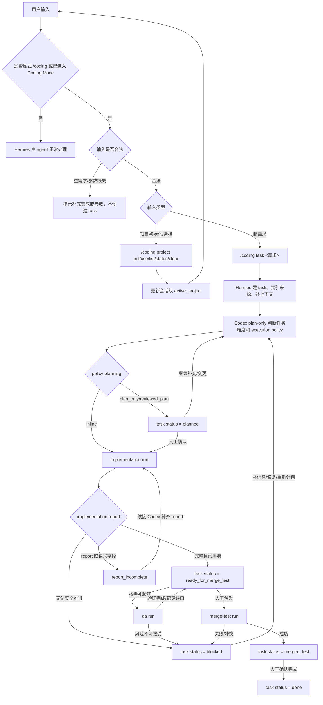
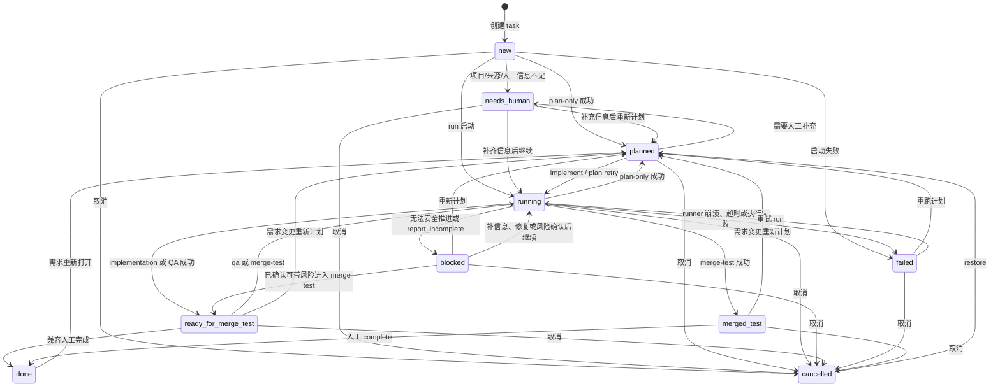

# Hermes Coding 状态机与流程图

这份文档说明 Hermes Coding 当前的状态分层：RunMode 是单次 Codex 执行的工作模式，run status 是这次执行的结果，task status 是任务对用户可见的推进状态，Kanban status 是 task status 的外部投影。

## 1. 整体 Coding 流程

## 2. RunMode 链路

RunMode 由 Codex plan report 的 `execution_policy_decision` 给出判断依据，Hermes 只负责执行控制和状态流转。

| 工作场景 | Codex policy | RunMode 链路 | 成功后的 task status |
|---|---|---|---|
| 快速修复 | `route=fast_fix`，`planning=inline`，`verification=targeted` | `implementation -> merge-test` | `ready_for_merge_test -> merged_test` |
| 小型 UI/文案/局部行为修复 | `route=targeted_ui_fix`，`planning=inline`，`context=focused` | `implementation -> qa? -> merge-test` | `ready_for_merge_test -> merged_test` |
| 标准需求 | `route=standard_change`，`planning=plan_only`，`verification=standard` | `plan-only -> implementation -> qa? -> merge-test` | `planned -> ready_for_merge_test -> merged_test` |
| 受保护变更 | `route=guarded_change`，`planning=reviewed_plan`，`verification=full_qa`，`confirm=true` | `plan-only -> human review -> implementation -> qa -> risk confirm -> merge-test` | `planned/needs_human -> ready_for_merge_test/blocked -> merged_test` |

## 3. RunMode、run status、task status

| RunMode | 目的 | `succeeded` 时 task status | `blocked` 时 task status | `failed` 时 task status |
|---|---|---|---|---|
| `plan-only` | 只读上下文，生成计划、影响分析和执行策略 | `planned` | `needs_human` 或 `blocked` | `failed` |
| `implementation` | 在 source branch/worktree 中实现、测试并由 Codex 生成 commit | `ready_for_merge_test` | `blocked`；若实现已落地但有缺口，仍由详情字段要求风险确认 | `failed` |
| `qa` | 复用 implementation worktree 做验证并记录证据 | 保持 `ready_for_merge_test` | `blocked` | `failed` |
| `merge-test` | 人工触发合入 test 分支 | `merged_test` | `blocked` | `failed` |

公开 run status 只有 5 个：

| run status | 含义 |
|---|---|
| `running` | 本次 run 正在执行 |
| `succeeded` | 本次 run 成功结束，下一步由 RunMode 决定 |
| `blocked` | 本次 run 需要补上下文、人工确认或风险判断 |
| `failed` | 本次 run 执行失败、超时或 runner 异常 |
| `cancelled` | 本次 run 已取消 |

旧 runner 状态不会扩展公开 run status。`success`、`queued`、`timeout`、`runner_failed`、`ready_for_merge_test_with_known_gaps` 等只作为兼容输入归一化；细节保存在 `raw_status`、`status_detail`、`failure_type`、`known_gaps` 和 `structured`。

## 4. TaskStatus 状态机

## 5. TaskStatus 与 Kanban 投影

| task status | 中文标识 | Kanban 动作 |
|---|---|---|
| `new` | 新建 | `kanban_comment` |
| `needs_human` | 待人工确认 | `kanban_comment` |
| `planned` | 已规划 | `kanban_comment` |
| `running` | 运行中 | `kanban_heartbeat` |
| `blocked` | 受阻 | `kanban_block` |
| `ready_for_merge_test` | 等待手动执行 merge test | `kanban_comment` |
| `merged_test` | 已合并 test，待人工完成 | `kanban_comment` |
| `failed` | 失败 | `kanban_comment` |
| `done` | 已完成 | `kanban_complete` |
| `cancelled` | 已取消 | `kanban_comment` |

Kanban 只展示用户能理解的 task status 和原因，不展示 runner 内部字段。内部字段仍会保留在 Task Ledger 和 run artifacts 中，方便排查。

## Report Incomplete

当 runner 返回的 report 缺少 Codex 语义字段时，任务不会被 Python 推断为完成。

处理方式：

1. Hermes 标记 run 为 `blocked`，`failure_type=report_incomplete`。
2. Hermes 保留 stdout/stderr/report artifact。
3. 下一步是续接 Codex，让 Codex 补齐完整结构化 report。
4. 只有 report 完整并通过 git/diff/schema gate 后，任务状态才继续流转。

## 6. Hermes 与 Codex 协同边界

| 角色 | 负责 | 不负责 |
|---|---|---|
| Hermes/Python | task ledger、状态机、manifest、schema 校验、路径和权限 gate、slash command、artifact 落盘、Kanban 投影 | 任务难度判断、用户摘要、技术摘要、下一步动作、风险解释、commit 文案 |
| Codex | 任务难度判断、执行策略、计划、实现、测试、QA 证据、用户摘要、技术摘要、风险说明、commit 信息、merge readiness | 直接改 task ledger、绕过 Hermes 合入、替用户确认风险或发布 |
| 人 | 确认计划、补上下文、接受风险、触发 merge-test、确认完成 | 重复搬运 runner 证据和内部状态 |

## 7. 人工动作速查

| 场景 | 推荐动作 |
|---|---|
| 先选项目 | `/coding project init <path>` 或 `/coding project use <name>` |
| 新需求 | `/coding task <需求>` |
| 补计划反馈 | `/coding continue <反馈>` |
| 需求变更 | `/coding change <反馈>` |
| 实现/QA 问题修复 | `/coding bugfix <反馈>` |
| 计划确认后实施 | `/coding implement <task_id>` |
| 开发完成后补验证 | `/coding qa <task_id>` |
| 开发完成后合 test | `/coding merge-test <task_id>` |
| QA 风险可接受 | `/coding merge-test <task_id> --confirm-qa-risk` |
| test 已合并且人工确认完成 | `/coding complete <task_id>` |
| 误取消恢复 | `/coding restore <task_id>` |
