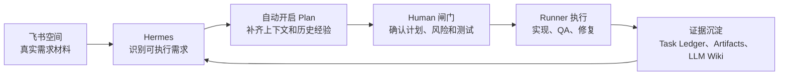

# AI 编码工作流：从飞书需求到可回放交付

这篇文档说明一件事：把原来靠人手动串起来的 Codex 开发流程，变成一套可以在团队里协作、追踪和复盘的 AI workflow。

它不是让 AI 绕过工程流程自动改代码，而是把“需求怎么进入、谁来判断、谁来执行、结果怎么验、经验怎么沉淀”这些环节固定下来。

## 1. 一句话结论

Hermes 负责控制面，Codex 负责语义判断和执行，人负责关键判断。

用户在飞书里提需求。Hermes 判断这是不是一个编码任务，做确定性的项目、来源、权限和状态校验；Codex 在结构化 report 里判断任务难度、风险和 Execution Policy。简单任务会得到 inline planning 策略，标准需求走 plan-only -> implementation，受保护变更会展开 reviewed plan -> implementation -> full QA -> merge-test 的完整链路。Runner 每次执行后的日志、diff、测试结果和报告都会回到 Hermes，任务状态写入 Task Ledger，有复用价值的经验写入 LLM Wiki。

| 角色 | 做什么 | 不做什么 |
| --- | --- | --- |
| 飞书 | 提需求、补反馈、确认关键节点 | 不直接驱动代码执行 |
| Hermes | 判断入口、建 task、执行 Codex 给出的链路策略、管状态、发执行包、收证据 | 不亲自写业务代码或业务语义结论 |
| Runner | 读代码、写代码、跑测试、做 QA | 不决定项目、状态、发布和飞书回写 |
| 人 | 确认计划、接受风险、触发 merge-test、确认完成 | 不重复搬运上下文和整理证据 |
| Task Ledger | 记录任务事实 | 不沉淀长期知识 |
| LLM Wiki | 沉淀可复用经验 | 不充当任务状态库 |

## Codex 与 Hermes 的职责边界

- Codex 负责：任务难度判断、执行策略、用户摘要、技术摘要、下一步动作、风险说明、分支候选名、实现是否落地、commit 信息、merge readiness。
- Hermes/Python 负责：Task Ledger、状态机、manifest、report schema 校验、git clean-tree gate、diff guard、路径安全、权限/scope 检查、slash command 分发和 artifact 落盘。
- Codex 输出不完整时，Hermes 不生成语义兜底；语义字段缺失会保持 `blocked` 并记录 `report_incomplete`，结构化 report 缺失、非法或 timeout 会进入失败/受阻恢复路径，不会根据 stdout、markdown 或 diff 推进任务。
- 飞书默认展示用户消息；run_id、artifact、source_status、recovery_action 等内部字段只进入调试信息。

## 2. 背景：为什么需要这套 workflow

前情文档：[Codex + superpowers 开发流程](https://bestfulfill.feishu.cn/wiki/GB11wYOkzinUGBkTbp0cbHvanNh)。

以前的 Codex 开发流程主要靠人串起来：人从飞书拿需求，判断项目，切本地目录，补上下文，让 Codex 出计划，确认后再实现、测试、处理 QA，最后手动整理 diff 和合入 test。

这套方式能跑通，但不稳定：

- 项目识别、分支选择、测试命令依赖个人记忆。
- plan、implementation、QA、bugfix、merge-test 没有统一状态。
- 一次 Codex run 做过什么、谁确认过、参考了哪些上下文，不容易回放。
- 日志、diff、QA 证据、人工确认分散在本地和聊天记录里。
- 有价值的项目经验没有沉淀，下次还要重新解释。

所以新的 workflow 不是替代 Codex，而是把人工 Codex 流程产品化：Hermes 管入口、状态、上下文、权限和证据；Codex 继续作为 Runner 执行；人保留计划确认、风险判断、merge-test 和发布决策。

## 3. 入口和角色分工：谁能启动编码流程

普通聊天不会自动进入编码流程。进入编码流程只有两种方式：

- 直接发送 `/coding <动作>`。
- 先发送“进入coding”，再用自然语言描述需求或反馈。

Coding Mode 只是降低输入成本。用户可以说“截图里的样式不对，修一下”，LLM 可以把它翻译成候选动作，比如 `/coding bugfix ...`；但是否执行，仍由 Hermes 校验。命令、rewrite prompt、help 文案和允许交给 Hermes 主 agent 的动作都来自同一份 command catalog，避免命令口径分叉。

__IMG_COMMAND_GATE__

这里的原则很简单：LLM 只翻译意图，不决定执行。

| 用户说法 | Hermes 应该理解成 | 结果 |
| --- | --- | --- |
| 现在有多少个任务 | `/coding list` | 只查询，不创建任务 |
| 这个需求改一下，只做列表 | `/coding change ...` | 回到计划阶段 |
| 截图样式不对，修一下 | `/coding bugfix ...` | 复用当前 task 修复 |
| 可以合并到 test | `/coding merge-test <task_id>` | 进入合入测试链路 |
| 删除这个任务 | `/coding delete ...` | 高风险动作，必须确认 |

如果项目不清楚、任务不清楚、图片或文档读取失败，Hermes 不会让 Runner 猜。

当前版本还会在 task 创建前做输入合法性检查：

| 输入 | 结果 |
| --- | --- |
| `/coding task` | 拒绝创建，提示补充任务需求 |
| `/coding task --project 订单系统` | 拒绝创建，提示补充完整需求 |
| `/coding task --project` | 拒绝创建，提示 `--project` 缺少参数值 |

这条规则很重要：进入 Coding Mode 后，自然语言会被 rewrite，但 plugin 不能因为空输入或只有参数没有需求就创建一个无意义 task。

## 4. 主链路：一条需求怎么走到交付

__IMG_FULL_CHAIN__

一条需求进入后，主链路拆成七步：

1. **识别输入**：飞书消息、Project 链接、文档、图片或 QA 反馈进入 Hermes。
2. **生成 task**：Hermes 判断意图和项目，把需求、来源、状态、负责人写入 Task Ledger。
3. **补齐上下文**：Hermes 从 LLM Wiki 找项目画像、历史问题、测试经验和约束。
4. **选择执行链路**：Codex 在 plan report 里给出 Execution Policy；Hermes 只校验和执行这份策略，决定后续用 inline implementation、标准 plan-only 链路，还是高风险 reviewed plan 链路。
5. **交给 Runner**：Hermes 生成执行包，Runner 在对应 RunMode 下执行计划、实现、QA 或 merge-test。
6. **验证和合入**：Runner 在受控工作区实现、测试、QA；人触发 merge-test。
7. **回收和沉淀**：Hermes 回收日志、报告、diff、测试证据，更新状态，把可复用经验写入 LLM Wiki。

这条链路的重点不是步骤多，而是每一步都有身份、有状态、有证据。

### 4.1 Execution Policy：任务难度决定 RunMode 链路

最新版本不是把所有任务都固定跑完整链路，而是让 Codex 在结构化 report 中判断任务难度和风险，再由 Hermes 按该决策执行不同深度的 RunMode pipeline。表里的触发线索是 Codex 可参考的任务特征，不是 Python 关键词分类规则。

| 任务类型 | 触发线索 | Execution Policy | RunMode 链路 | 典型 task status |
| --- | --- | --- | --- | --- |
| 快速修复 | `.gitignore`、`.gstack`、简单修、小问题 | `route=fast_fix`，`planning=inline`，`verification=targeted` | `plan-only(policy) -> implementation -> merge-test` | `planned -> running -> ready_for_merge_test -> merged_test -> done` |
| 小型 UI 行为修复 | 复制、文案、标题、链接、tooltip 等局部行为 | `route=targeted_ui_fix`，`planning=inline`，`context=focused` | `plan-only(policy) -> implementation -> merge-test`，按需补 QA | `planned -> running -> ready_for_merge_test -> merged_test -> done` |
| 标准需求 | 多步骤、字段、接口、筛选项、前后端对齐、skill/doc 变更 | `route=standard_change`，`planning=plan_only`，`verification=standard` | `plan-only -> implementation -> qa? -> merge-test` | `planned -> running -> ready_for_merge_test -> merged_test -> done` |
| 受保护变更 | 发布、部署、权限、鉴权、数据库、支付、安全、生产 | `route=guarded_change`，`planning=reviewed_plan`，`verification=full_qa`，`confirm=true` | `plan-only -> human review -> implementation -> full QA -> risk confirm -> merge-test` | `needs_human/planned -> running -> ready_for_merge_test/blocked -> merged_test` |

这里的 `RunMode` 不是“任务状态”，而是单次 Runner 执行的工作模式：

| RunMode | 做什么 | 成功后推进到 |
| --- | --- | --- |
| `plan-only` | 只读上下文、生成计划或影响分析，不改项目文件 | `task status = planned` |
| `implementation` | 在 source branch/worktree 中实现或修复 | `task status = ready_for_merge_test` |
| `qa` | 复用 implementation worktree 做验证并记录 QA 证据 | 仍保持 `ready_for_merge_test` |
| `merge-test` | 人工触发合入 test 分支 | `task status = merged_test` |

Run status 只表示“这一次 RunMode 怎么结束”，task status 才表示“业务任务下一步能做什么”：

| run status | 常规 task status 投影 |
| --- | --- |
| `running` | `running` |
| `succeeded` | 由 RunMode 决定：plan-only -> `planned`，implementation/QA -> `ready_for_merge_test`，merge-test -> `merged_test` |
| `blocked` | `blocked`；只有 Codex report 的 `merge_readiness.ready=true` 或人工 `--accept-risk` 放行时，才可进入 `ready_for_merge_test` |
| `failed` | `failed`；timeout、runner failed、结构化 report 缺失或非法不会投影为成功 |
| `cancelled` | `cancelled` |

旧状态例如 `success`、`queued`、`timeout`、`runner_failed`、`ready_for_merge_test_with_known_gaps` 会被归一到这 5 个主 run status；细节保存在 `raw_status`、`status_detail`、`failure_type`、`known_gaps` 和 `structured` 中，避免主状态膨胀。非结构化输出不会再被当作成功证据，`completed_unstructured` 和未知 runner 状态会进入 blocked/failed 恢复路径。

### 4.2 需求交付拆解：从父需求到执行任务

最新插件支持把需求先作为父级 requirement 管理，再按复杂度拆成可执行任务。父级需求保存原始诉求、拆解报告、整体进度和验收口径；execution 子任务才进入单项目、单 repo、单 worktree 的实现链路。

主命令链路是：

```text
/coding task <需求>
/coding breakdown <task_id>
/coding approve-breakdown <task_id>
/coding materialize <task_id>
/coding run <task_id> --next
```

`/coding breakdown` 使用 decomposition RunMode，让 Codex 输出交付单元、执行任务、依赖、风险、验收计划和开放问题。Hermes 通过 Report Admission Gate 做确定性校验：schema 不完整、依赖引用不存在、依赖成环或 `materialization_allowed=false` 时，不创建子任务，也不推进状态。

人确认拆解后，`/coding materialize` 才会生成 execution 子任务。父级需求收到 `/coding run <task_id> --next` 时，Hermes 只选择依赖已满足的下一个 execution task；如果剩余子任务都被阻塞或依赖未完成，则停在父级需求上展示原因。

### 飞书中的交付视图

父级需求优先展示交付视图：整体进度、交付单元、关键风险、阻塞点和下一步。子任务继续使用现有执行链路和状态同步。Report Admission Gate 拒绝的结果只展示为需要修复结构化 report 或补充信息，不会被当作成功结果同步。

用户可以用 `/coding status <task_id> --delivery` 看总体交付进度，用 `/coding status <task_id> --tree` 看父子任务和依赖关系。Kanban 只投影 task status，并附带 `task_kind`、`root_task_id`、`parent_task_id` 等层级元数据；Task Ledger 仍是唯一事实源。

## 5. Task 流程：状态、证据和人工闸门

Task 流程回答三个问题：当前走到哪一步，有什么证据，下一步能不能自动继续。

__IMG_TASK_FLOW__

正常状态大致是：

```text
需求进入 -> 计划待确认 -> 实现中 -> 验证中 -> 等待 merge-test -> 已合入 test -> 完成
```

中途如果需求变化，就回到计划；如果 QA 发现问题，就回到实现；如果测试缺口、权限不足或风险太高，就停下来等人判断。

关键人工闸门只有几类：

| 闸门 | 为什么必须有人 |
| --- | --- |
| 计划确认 | 防止 Runner 理解错需求后直接改代码 |
| 项目识别不清 | 防止把需求投到错误仓库或错误模块 |
| 删除、取消、合并 | 这些动作会改变任务或分支状态 |
| 测试证据不足 | 需要人判断风险是否可接受 |
| 发布测试环境或生产环境 | 发布权不交给 Runner |
| 最终完成 | 完成状态必须来自人的确认 |

现在 QA 是显式 RunMode，不再由 implementation 完成后无条件自动触发。实现完成后，任务会进入 `ready_for_merge_test`；人可以根据风险选择 `/coding qa <task_id>` 补验证，也可以在确认已有证据足够时触发 `/coding merge-test <task_id>`。如果最近 QA 失败、过期或缺失，merge-test 会要求确认 QA 风险。

Kanban 也是 task status 的投影，不是另一个事实源：

| task status | Kanban 动作 |
| --- | --- |
| `running` | `kanban_heartbeat` |
| `blocked` | `kanban_block` |
| `done` | `kanban_complete` |
| 其它状态 | `kanban_comment`，写入中文状态和原因 |

状态和数据也必须分开。

__IMG_STATE_DATA__

| 数据区域 | 回答的问题 | 保存内容 |
| --- | --- | --- |
| Task Ledger | 当前任务现在怎样 | 状态、run、人工确认、工作区、合并记录 |
| Run Artifacts | 这次到底怎么执行 | 输入包、日志、报告、diff、测试证据 |
| LLM Wiki | 下次还能复用什么 | 项目画像、历史经验、QA 结论、稳定约束 |

简单说：Task Ledger 是事实账本，Run Artifacts 是执行证据，LLM Wiki 是长期记忆。三者不能混，否则系统会出现多个事实源。

## 6. 前端任务的交付口径

前端任务更依赖上下文，因为需求常常散落在飞书消息、截图、设计稿、接口文档、页面链接、测试环境和 QA 反馈里。Hermes 的价值不是替开发者做判断，而是先把这些信息收拢成一个清楚的 task，再交给 Runner 执行。

进入 plan 前，前端任务至少要尽量回答几个问题：

| 需要确认什么 | 为什么重要 |
| --- | --- |
| 页面入口和目标端 | 确认影响的是哪个页面、哪个路由、桌面端还是移动端 |
| 截图、设计稿或验收描述 | 防止 Runner 只按文字猜 UI |
| 接口状态 | 区分真实接口、mock 数据、接口未完成或接口异常 |
| 组件库和设计系统约束 | 判断应该复用现有组件，还是需要新增实现 |
| 测试环境、账号和权限 | 决定能不能做浏览器验证和真实交互检查 |

前端完成也不能只看代码和单元测试。Runner 需要尽量留下这些证据：

| 证据 | 说明 |
| --- | --- |
| 页面截图 | 展示核心页面或关键状态已经渲染 |
| 关键交互验证 | 说明点击、输入、切换、提交等动作是否跑过 |
| 响应式检查 | 说明桌面端、移动端或目标断点是否验证过 |
| 浏览器控制台结果 | 记录是否有明显 console error 或资源加载问题 |
| 接口/数据说明 | 标明使用真实接口、mock 数据，还是接口缺失 |
| 未验证项 | 明确哪些内容因为环境、权限、接口或设计稿缺失没有验证 |

如果缺少设计稿、真实接口、测试账号或测试环境，任务不能假装完全验证。Hermes 应该把它标成带已知缺口的状态，让人决定风险是否可接受。

LLM Wiki 也要沉淀前端特有经验：组件库用法、设计 token、布局约定、响应式断点、常见样式坑、接口返回习惯、浏览器 QA 结论。设计稿和组件库冲突时，Runner 不应该自己拍板，而应该把冲突和可选方案报告给 Hermes，交给人确认。

## 7. Runner 原理：执行包、受控工作区、结果回收

Runner 可以是 Codex，也可以是以后接入的其他编码工具。它只负责执行，不拥有流程决策权。

Codex Runner 的原理可以压成三句话：

1. Hermes 先把任务边界写成文件，而不是把所有东西塞进一句 prompt。
2. Codex 在指定工作区里按这些文件执行，可以读代码、改代码、跑测试。
3. Codex 结束后，Hermes 回收结构化报告和证据，再决定任务状态怎么流转。

核心执行包包括：

| 文件 | 作用 |
| --- | --- |
| `input-prompt.md` | 本轮任务入口，只放目标、增量上下文和 artifact 引用 |
| `run-instructions.md` | 执行契约：允许做什么、禁止做什么、报告怎么输出 |
| `run-manifest.json` | 本轮事实清单：task、run、workspace、分支、权限、Wiki 引用 |
| `execution-policy.json` | 本轮策略：route、planning、context、implementation、verification、timeout 和 reasons |
| `context-index.md` | 本轮可用上下文索引，避免 prompt 直接塞满原文 |
| `report.schema.json` | 要求 Runner 输出固定结构 |
| `wiki-context.md` | 从 LLM Wiki 检索出的项目知识和历史经验 |
| `confirmed-plan.md` / `implementation-context.md` | implementation、QA、merge-test 的阶段上下文引用 |

plan-only 阶段主要读上下文，不改项目文件；inline implementation 不会伪造 confirmed plan artifact，而是直接收到轻量实现策略；implementation、QA、merge-test 在 task worktree 中执行。这样 Runner 有足够能力完成任务，但不能自己决定项目、状态、合入或发布。

每次执行结束后，Hermes 回收 `stdout.log`、`stderr.log`、`report.json`、`summary.md`、`diff.patch` 和压缩后的 `run-log.md`。如果 Runner 超时、崩溃或报告格式不对，Hermes 会生成兜底报告，把状态归一到可恢复的失败或阻塞状态。

如果 Hermes terminal/process runtime 可用，Codex CLI 会作为后台任务启动，并打开 `notify_on_complete`。Hermes 先把 run 记录为 `running`，随后通过完成回传或 `/coding status` 的自动 reconciliation 读取 artifact，回收最终状态。这让飞书消息不会长时间阻塞，也能复用同一个 Codex session 继续 plan、implementation、QA 和 merge-test。

## 8. LLM Wiki 原理：长期记忆怎么沉淀和复用

LLM Wiki 不是任务状态库，而是团队记忆。

__IMG_KNOWLEDGE_LOOP__

它主要解决三件事：

- 项目不用每次从零识别，可以先看项目画像。
- 历史坑位不用每次重新解释，可以从 run 总结和 QA 经验里带出来。
- 人工反馈不会只停在聊天记录里，后续 plan revision 和 bugfix 能继续读到。

写入时，Hermes 不会把整段聊天都塞进 Wiki，而是从需求、人工反馈、Runner 报告和 QA 结论里提炼稳定知识。

读取时，Hermes 也不会把整库塞给 Codex，而是按“当前需求 + 项目名”检索相关页面，生成 `wiki-context.md`，并把引用 ID 写进 Task Ledger 和 `run-manifest.json`。这样后续可以回放：这一轮 Runner 到底参考了哪些知识。

边界同样清楚：任务状态只写 Task Ledger，执行过程只进 Run Artifacts，长期经验才进 LLM Wiki。

LLM Wiki 初始化后默认放在 `~/.hermes/coding-orchestration/llm-wiki`。目录设计也围绕这条边界展开：

| 目录或文件 | 用途 |
| --- | --- |
| `purpose.md` | 说明 Wiki 边界：运行状态归 Task Ledger，可复用知识才进 LLM Wiki |
| `schema.md` | 说明页面 frontmatter，例如 `id`、`kind`、`project`、`status`、`source_refs` |
| `raw/sources/` | 保存原始来源快照，用来追溯知识从哪里来 |
| `raw/assets/` | 预留图片、附件等资产位置 |
| `wiki/entities/` | 项目画像等实体知识，例如 `project_profile` |
| `wiki/concepts/` | 稳定概念知识，例如 `verified_knowledge` |
| `wiki/sources/` | 需求草稿、人工计划反馈等来源型知识 |
| `wiki/synthesis/` | 综合沉淀，例如 `run_summary` 和 `qa_experience` |
| `wiki/comparisons/` / `wiki/queries/` | 对比类和查询类文档 |
| `wiki/index.md` / `wiki/overview.md` / `wiki/log.md` | 自动索引、概览统计和写入日志 |
| `.llm-wiki/config.json` | 本地配置，记录 layout、version、storage |
| `.obsidian/` | 给 Obsidian 这类 Markdown 知识库工具预留 |

兼容旧数据时还会读取 `index.jsonl`。新知识不会再写进去，只把它当旧版只读输入，避免历史 debug 数据在迁移时丢失。

## 9. 当前版本边界

当前版本先追求稳定闭环：

- 飞书里能创建和推进 coding task。
- Coding Mode 能把自然语言改写成标准动作；高置信度直接执行，高风险动作必须确认，低置信度动作会交给 Hermes 主 agent 基于插件上下文继续判断。
- 空 `/coding task` 和 flag-only 输入不会创建无效 task。
- Execution Policy 由 Codex 根据任务难度写入结构化 report，Hermes 只做校验和执行控制。
- 计划和实现之间可以有人工确认；快速修复和小型 UI 行为修复会使用 inline planning 的轻量实现策略，不伪造 confirmed plan artifact。
- QA 是独立 RunMode；实现后默认进入 `ready_for_merge_test`，人按风险决定是否补 QA。
- 问题反馈能回到同一个 task 继续修，并复用 source branch/worktree 和 Codex session。
- merge-test 由人触发，成功后进入“已合入 test”，不会自动完成。
- 每次 Runner 执行都有日志、报告、摘要、diff 和测试证据。
- Kanban、Dashboard 和 pre-LLM context 只投影当前事实，不取代 Task Ledger。
- `/coding doctor`、`/coding lark-preflight`、`/coding source-resolve` 能诊断运行时、飞书权限和来源链接问题。
- `/coding project init/use/status/clear` 能管理 active_project 和项目画像初始化质量。
- 有复用价值的项目经验能沉淀到 LLM Wiki。

当前不追求复杂多 agent 平台，也不自动发布环境。先把一条需求从进入到交付的链路跑稳，比堆更多能力更重要。

## 10. 未来展望：让真实需求自然进入工作流

未来成熟形态不是替换现有协作方式，而是让真实需求继续自然落在飞书空间里，由 Hermes 在背后识别并开启 plan。



业务、产品、设计、研发继续使用原来的飞书协作模式。本次建设是在提前打稳入口、状态、Runner、证据和 Wiki 边界，为后续真实需求自动进入工作流做准备。

## 11. 图片使用原则

这一节只保留在本地稿中，飞书宣讲存档不展示。

文档里的图片只表达流程、边界和状态，不伪造真实项目界面。如果后续要展示某个业务系统的真实页面、测试环境截图或飞书 Project 详情，建议先留空，等拿到真实截图后再补。伪截图会让读者误以为系统已经具备某个具体界面能力，反而降低可信度。
